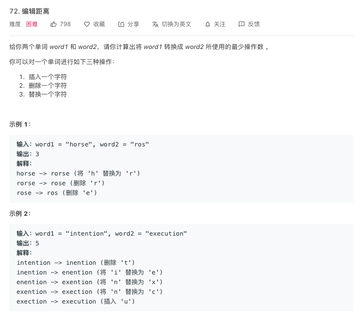

# 编辑距离
---
## LeetCode

> [77. Edit Distance](https://leetcode-cn.com/problems/edit-distance/)

## 题目描述




## 代码框架
解决两个字符串的动态规划问题，一般都是用两个指针 i,j 分别指向两个字符串的最后，然后一步步向前移动，缩小问题的规模。
```Swift
if s1[i] == s2[j] {
    返回结果
} else {
    优解(插入，删除，替换)
}
```

## 代码实现
使用二维数组`dp[i][j]`表示`s1[0...i]`与`s2[0...j]`的最小编辑距离.
```Swift
minDistance(_ word1: String, _ word2: String) -> Int {
    //存在空字符串的判断
    if word2.count * word1.count == 0 {
        return word1.count + word2.count
    }

    let s1 = [Character](word1)
    let s2 = [Character](word2)

    //注意初始化
    for i in 0...s2.count {
        dp[i][0] = i
    }

    for i in 0...s1.count {
        dp[0][i] = i
    }

    var dp = [[Int]](repeating:[Int](repeating: 0, count: s1.count + 1), count: s2.count + 1)

    for i in 1...s2.count {
        for j in 1...s1.count {
            //索引从1位置开始遍历，所以在取值时要后退一位，否则s1越界
            if s2[i - 1] == s1[j - 1] {
                dp[i][j] = dp[i - 1][j - 1]
            } else {
                dp[i][j] = min(
                    dp[i - 1][j] + 1,
                    min(dp[j][i - 1] + 1,dp[i - 1][j - 1] + 1
                    )
                )
            }
        }
    }
    return dp[s2.count][s1.count]
}
```

## 代码详解

当编辑`s1`->`s2`时，那么所有的操作都是针对字符串`s1`，当然也可以选择编辑`s2`->`s1`.

1. 返回结果
> return dp[i - 1][j - 1]

相等时，不需要编辑，编辑距离为`s1[i - 1]` 和 `s2[j - 1]`的结果

1. 插入
> dp[i, j - 1] + 1

当在`s1[i]`位置插入一个与`s2[j]`相同的字符，`s2[j]`被匹配成功，然后移动`j`,编辑`+1`

1. 删除
> dp[i - 1][j] + 1

当`s2`已经遍历完，但`s1`还没有结束，此时只需要将`s1`剩余的部分直接删除就可以，编辑`+1`

4. 替换
> dp[i - 1, j - 1] + 1

替换`s1[i]`的字符，`s1[i]`和`s2[j]`匹配成功，`i`和`j`位置移动，编辑`+1`