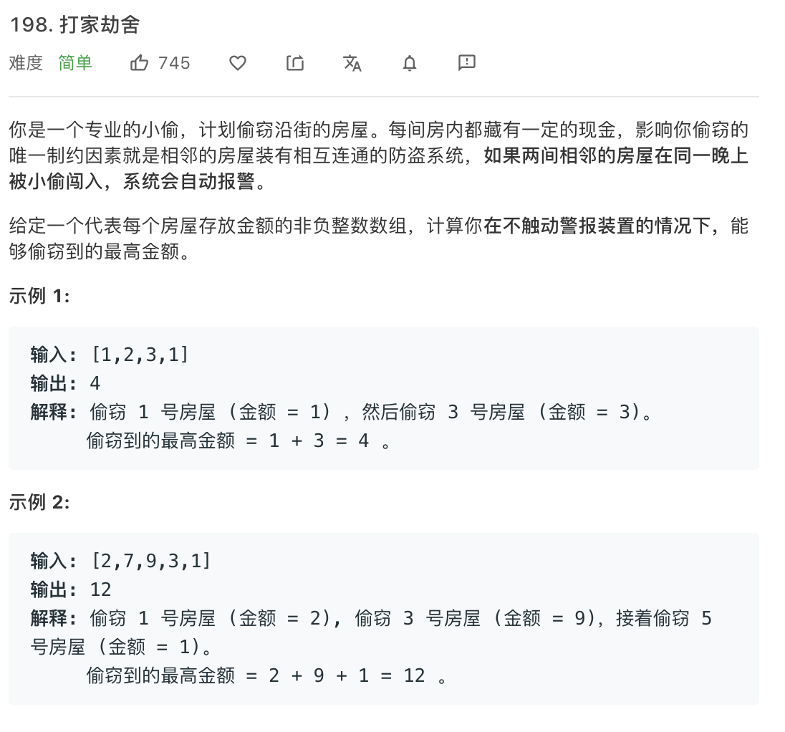
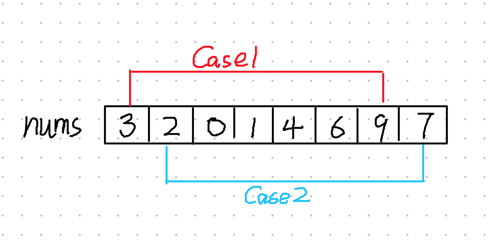
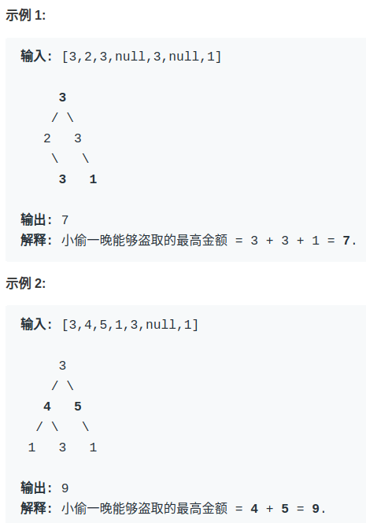

# 打家劫舍系列
---

## 一排房屋的打劫问题
> [198. House Robber](https://leetcode-cn.com/problems/house-robber/)



### 状态

> `dp[i]`当前为第`i`个房屋时抢到最多的钱数。

### 选择和状态转移方程
定义打劫顺序为从左到右，由于不能打劫相邻房屋，因此在第`i`个房屋时可做的选择为**(左房屋，左左房屋 + 当前房屋)**
动态方程可以写成为
> `dp[i]` = max(dp[i - 1], dp[i - 2] + nums[i])

### 实现代码
```Swift
var dp_0 = 0
var dp_1 = 0
var dp_i = 0
for i in 0..<nums.count {
    dp_i = max(dp_1, dp_0 + nums[i])
    dp_0 = dp_1
    dp_1 = dp_i
}
return dp_i
```
在上述代码中发现没有使用`dp`数组，原因是`dp_i`只和前面两个状态相关，因此用两个变量来存储就可以了，同时空间复杂度也将变为`O(1)`.

## 环形房屋
这道题的不同之处在于，由于房屋围成了一圈，同时又不能打劫连续的房屋，此时起始位和最后一个房子将会相邻，因此也只能二选一。针对这种情况，划分成以下两个子问题


现在可以先对图中的`Case1`和`Case2`分别按照上一题的方式求出最值，最后再取二者的最大值。

### 代码实现
```Swift
func rob(_ nums: [Int]) -> Int {
    //特判
    if nums.count == 0 {
        return 0
    }
    if nums.count == 1 {
        return nums[0]
    }

    let case1 = robHelp(nums, 0, nums.count - 2)
    let case2 = robHelp(nums, 1, nums.count - 1)
    return max(case1, case2)
}

func robHelp(_ nums: [Int], _ start: Int, _ end: Int) -> Int {
    var dp_0 = 0
    var dp_1 = 0
    var dp_i = 0
    for i in start...end {
        dp_i = max(dp_1, dp_0 + nums[i])
        dp_0 = dp_1
        dp_1 = dp_i
    }
    return dp_i
}
```
至此，环形房屋的问题也就得以解决。

## 二叉树房屋

问题改为，每个房屋都在二叉树的结点上，不能对相连的房屋进行打劫。



### 代码实现
这里我只写出了自己容易理解的一个解决方案，递归二叉树 + 备忘录
```Swift 
//伪代码
var memo = [TreeNode]()
fun dp(_ root: TreeNode) -> Int {
    if root == null {
        return 0
    }
    
    //剪枝
    if memo.contains(root) {
        return memo[root];
    }

    //做选择 
    let rob = root.val + dp(root.left.left) + dp(root.left.right)
    let not = dp(root.left) + dp(root.right)

    let res = max(rob, not)
    memo.append(res)

    return res
}
```

