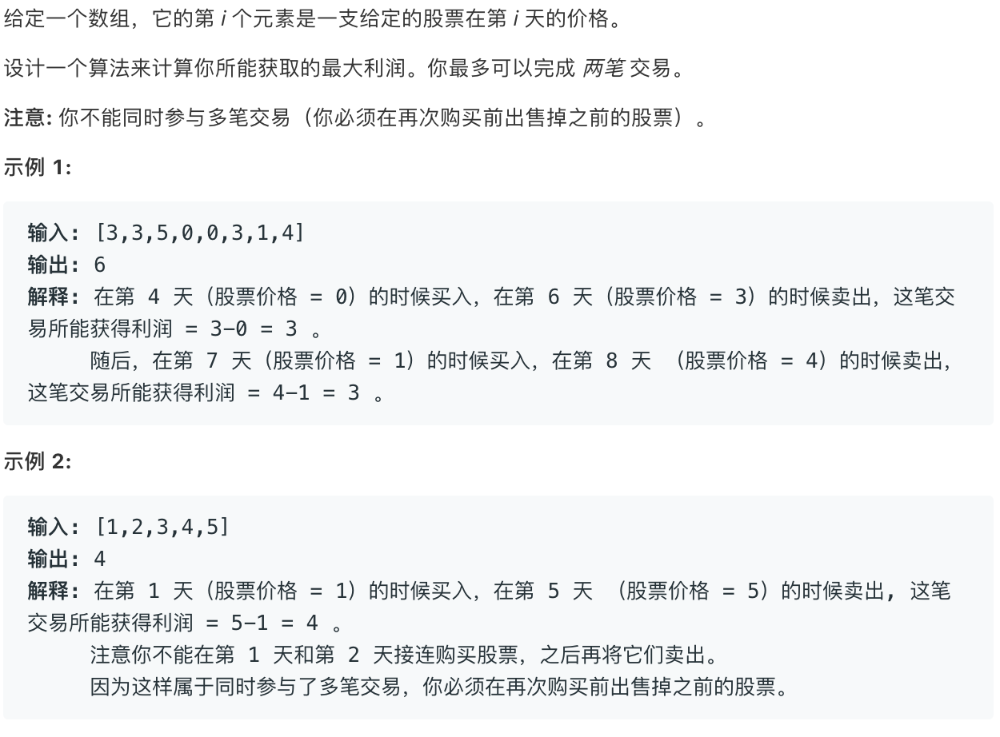

# 股票买卖系列
---

## 题目描述


## 代码框架
```Swift
for i in 0..<n {
    for k in 1...K {
        for s in {0, 1} {
            dp[i][k][s] = max(buy, sell, rest)
        }
    }
}
```
> i:天数，k:交易次数，s:当前持有状态

`dp[3][2][1]`表示在第三天，持有股票，可以交易两次

`dp[n - 1][K][0]` 表示最后一天，在最多允许交易K次的前提下卖出所有股票所获得的最大利润。

## Base Case 
```Swift
Base Case
//当天数为-1，也就是还没开始的时候，盈利为0
dp[-1][k][0] = 0
//k为0表示当前不允许交易，盈利为0
dp[i][0][0] = 0      
//不存在当交易还没开始时，持有股票
dp[-1][k][1] = -infinity
//不存在当不能交易时持有股票
dp[i][0][1] = -infinity
```
## 状态转移
对于股票的操作有三种选择：抛出，买入还有无操作
```Swift
//昨天无 + 今天rest，昨天有 + 今天sell
dp[i][k][0] = max(rest， sell) = max(dp[i - 1][k][0], dp[i - 1][k][1] + prices[i]) 

//昨天持有，今天rest，昨天无，今天buy
dp[i][k][1] = max(rest，buy) = max(dp[i - 1][k][1], dp[i - 1][k - 1][0] - prices[i])
```
`k`的改变发生在买卖时，因此在`sell`或者`buy`对其进行修改

## 实例运用
1. 只能进行一次交易，即`K = 1`
> [121. 买卖股票的最佳时机](https://leetcode-cn.com/problems/best-time-to-buy-and-sell-stock/)

```Swift
dp[i][0] = max(dp[i - 1][0], dp[i - 1][1] + prices[i])
dp[i][1] = max(dp[i - 1][1], -prices[i])
```
因为`K`一直都是1，所以可以省略掉。

2. 不限制交易次数，那么`K = +infinity`

> [122. 买卖股票的最佳时机 II](https://leetcode-cn.com/problems/best-time-to-buy-and-sell-stock-ii/)

```Swift
let dp_i_0 = dp[i][0] 
dp[i][0] = max(dp[i - 1][0], dp[i - 1][1] + prices[i])
dp[i][1] = max(dp[i - 1][1], dp_i_0 - prices[i])
```
这里可以看到也忽略了`K`这个状态，因为不限制交易次数，那么也就等同于一个常量，因此就可以忽略掉了。
`dp_i_0`临时变量用于存储转移前的那一次状态。

3. 不限制次数，但每次交易之间要隔一天
   
> [309. 最佳买卖股票时机含冷冻期](https://leetcode-cn.com/problems/best-time-to-buy-and-sell-stock-with-cooldown/)

```Swift
let dp_i_0 = dp[i][0]
dp[i][0] = max(dp[i - 1][0], dp[i - 1][1] + prices[i])
dp[i][1] = max(dp[i - 1][1], dp_i-2_0 - prices[i])
dp_i-2_0 = temp
```
同样因为不限制次数，所以把状态`K`省略。不同的是，此题在交易时增加了一个冻结时间为一天，因此`k`的修改也就发生了变化，由原来的`k-1`变为`k-2`,同时在存储第`i`天的状态时，还需要存储`i-2`的状态


4. 不限制次数，但每次交易产生交易费

> [714. 买卖股票的最佳时机含手续费](https://leetcode-cn.com/problems/best-time-to-buy-and-sell-stock-with-transaction-fee/)

```Swift
let dp_i_0 = dp[i][0]
dp[i][0] = max(dp[i - 1][0], dp[i - 1][1] + prices[i])
dp[i][1] = max(dp[i - 1][1], dp_i_0 - prices[i] - fee)
```
费用发生在交易时，因此在`sell`或`buy`时，扣除费用即可

5. 限制最大交易次数为2
   

> [123. 买卖股票的最佳时机 III](https://leetcode-cn.com/problems/best-time-to-buy-and-sell-stock-iii/solution/tong-su-yi-dong-de-dong-tai-gui-hua-jie-fa-by-marc/)

```Swift
let k = 2
let dp[][][] = dp[n][k + 1][2]
for i in 0..<n {
    if i - 1 == -1 {
        //处理base case
    }

    dp[i][k][0] = max(dp[i - 1][k][0], dp[i - 1][k][1] + prices[i])
    dp[i][k][1] = max(dp[i - 1][k][1], dp[i - 1][k - 1][0] - prices[i])
}
return dp[n - 1][k][0]
```
与前面不同，这次无法忽略交易次数`K`,所以增加状态`K`