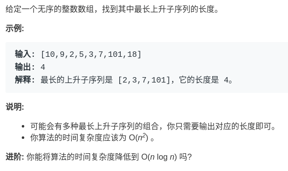

# 子序列问题合集
---

**子串**和**子序列**都属于字符串的一个序列，区别为：

* 子串：表示一段**连续**的序列
* 子序列：是按照顺序取出的一段**非连续**的序列

按照操作字符串个数的不同，总结了几个常见的问题解法。

- 一个字符串：「最长递增序列」、「最长回文子序列」
- 两个字符串：「最长公共子序列」、「编辑距离」

对于一个和两个字符串的操作，可以按照下面这两个通用思路模版来解决问题。

## 思路模版
> 一维DP数组
```Swift
for i in 1..<n {
    for j in 0..<i {
        dp[i] = 择优(dp[i], dp[j] + ...)
    }
}
```
> 二维DP
```Swift
for i in 0..<n {
    for j in 0..<n {
        if arr1[i] == arr2[j] {
            dp[i][j] = dp[i][j] + ...
        } else {
            dp[i][j] = 择优(dp[i][j], dp[i][j] + ...)
        }
    }

    return dp[i]
}
```
其中二维DP数组的含义又分为「一个字符串」和「两个字符串」两种情况。

接下来看看实际的运用。

### 最长递增子序列
按照一维的模版来实现下「最长递增子序列」这个问题
> [300. Longest Increasing Subsequence](https://leetcode-cn.com/problems/longest-increasing-subsequence/)



`dp`数组表示在`arr[i...j]`中的最常递增子序列


实现代码
```Swift
for i in 1..< {
    for j in 0..<j {
        if nums[j] < nums[i] {
            dp[i] = max(dp[i], dp[j] + 1)
        }
    }
    return dp.max()
}
```

### 最长回文子序列
使用**二维DP**数组解决**一个字符串**的问题。
> [516. Longest Palindromic Subsequence](https://leetcode-cn.com/problems/longest-palindromic-subsequence/)


* `dp`数组的含义: 在`arr[i...j]`中最长的回文子序列为`dp[i][j]`
* `Base Case` 如果只有一个字符时，直接返回1，即`dp[i][j] = 1(i == j)`.

* 在满足条件时进行状态转移


实现代码
```Swift
for i in (0..<n).reverse {
    for j in (i + 1)..<n {
        if s[i] == s[j] {
            dp[i][j] = dp[i + 1][j - 1] + 2
        } else {
            dp[i][j] = max(dp[i][j - 1], dp[i + 1][j])
        }
    }
}

return dp[0][n - 1]

```

### 最长公共子序列
使用**二维**DP数组解决「两个字符串」的最长子序列
> [1143. Longest Common Subsequence](https://leetcode-cn.com/problems/longest-common-subsequence/)


`dp`数组定义为对于`s1[1...i]`和`s2[1...j]`，它们的最长共哦给你子串为`dp[i][j]`.

实现代码
```Swift
for i in 1...m {
    for j in 1...n {
        if s1[i - 1] == s2[j - 1] {
            dp[i][j] = dp[i - 1][j - 1] + 1
        } else {
            dp[i][j] = max(dp[i - 1][j], dp[i][j - 1])
        }
    }
}

return dp[m - 1][n - 1]
```