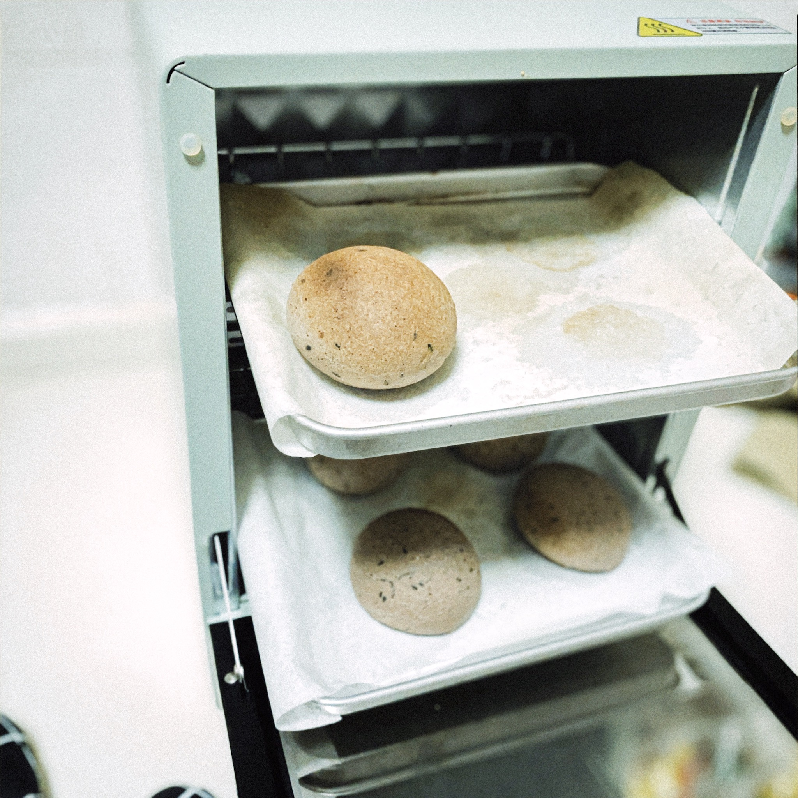

# 生活就应该像食物一样多姿多彩
---

关于烧菜做饭，对我而言是件很愉悦的事情，平凡的每天需要增加点生活的气息。

> **餐具系列**
<figure>
    
    
</figure>

> **麻薯、芋圆和越南春卷**

<figure>
    
    
    
    
    
    
    
    
    
    
    
    
</figure>

> **北方式早饭**
<figure>
    
    
    
    
</figure>

> **我的拿手菜**

<figure>
    
    
    
    
    
    
    
</figure>

> **最爱面食**

<figure>
    
    
    
    
</figure>

## 年味回忆

