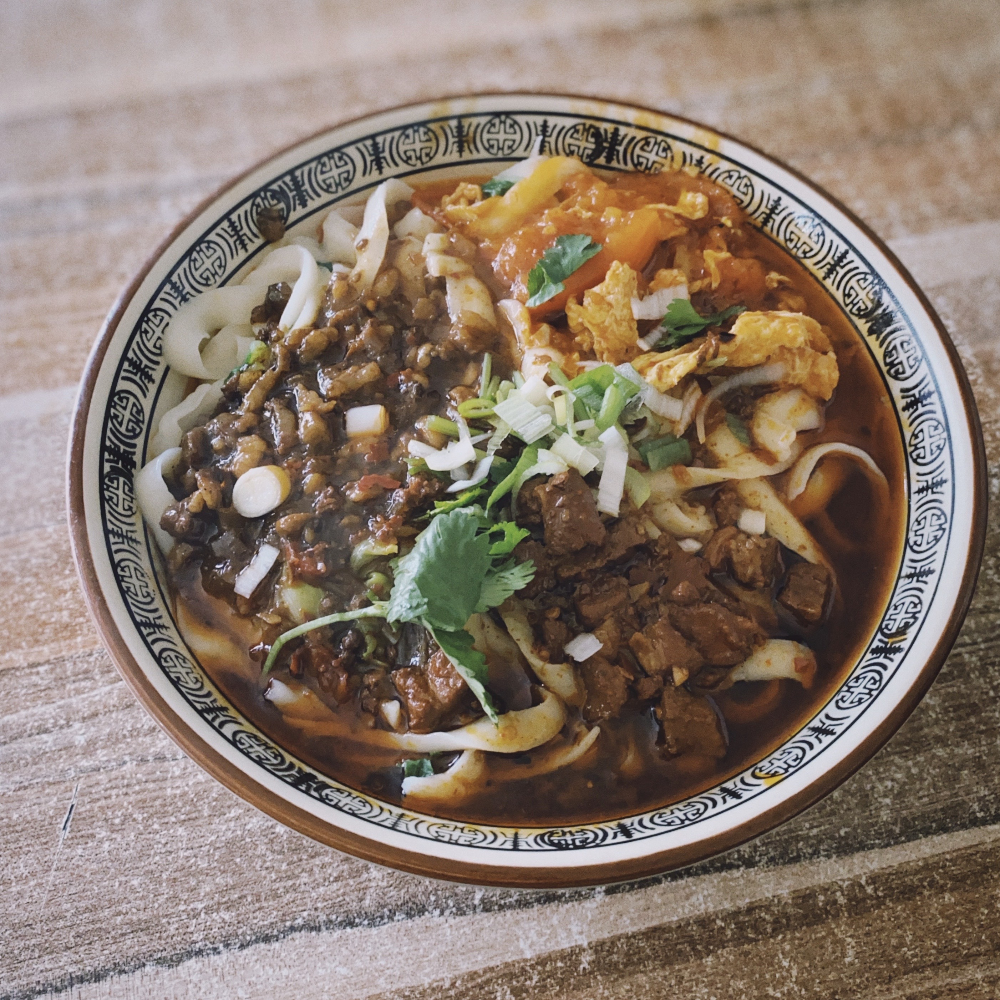

# 生活就应该像食物一样多姿多彩
---

关于烧菜做饭，对我而言是件很愉悦的事情，平凡的每天需要增加点生活的气息。

> **餐具系列**

好看的餐具可以体现出一个人对生活品质有所追求的一面。
<figure>
    
    
</figure>

> **麻薯、芋圆和越南春卷**

闲暇的周末，放点音乐，然后一起动手做点自己喜欢的食物。
<figure>
    
    
    
    
    
    
    
    
    
    
    
    
</figure>

> **北方人的家常早饭**

馒头 + 稀饭 + 萝卜丝
<figure>
    
    
    
    
</figure>

> **我的拿手菜**

算是用来记录一个厨房菜鸟成长的辛酸历史了...
<figure>
    
    
    
    
    
    
    
</figure>

> **面食爱好者**

即使毕业后来了南方，但一直割舍不下对面食的留恋～
<figure>
    
    
    
    
</figure>

## 年味回忆

从小到大，每逢过年老爸都要炸花生米，熬肉冻，剁肉馅包饺子和包子。

