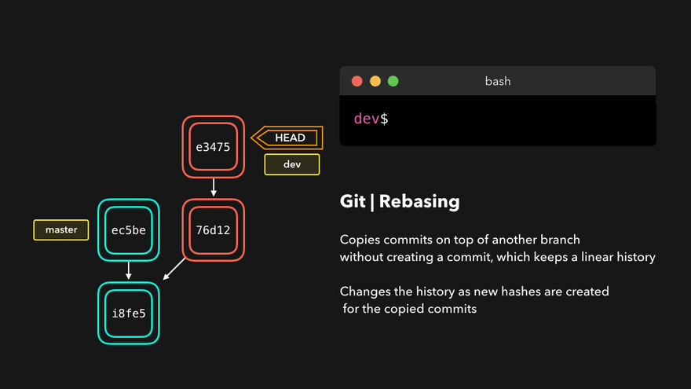

# Git常用操作图解
---

> 来源 https://dev.to/lydiahallie/cs-visualized-useful-git-commands-37p1

## Merge操作
### Fast Foward(--ff)

当前的分支没有其他提交记录时，`Git`会使用`--ff`进行快速合并，此时不会在分支上创建新的`Commit`记录。

### No Fast Foward(--no-ff)

当分支上有其他`Commit`记录时，这时`Git`将会采用`--no-ff`来进行合并。与之前不同的是，此时会创建新的提交记录

### 解决Merge冲突

当Merge时如果存在合并冲突，那么需要编辑冲突文件，然后在合并。

## 使用Rebase来合并分支

上面的Merge操作在合并时会在分支上创建一条提交记录，而`Rebase`不会创建提交记录，它是直接将我们分支上提交的改动复制到`master`分支的顶部。

### Rebase的其他操作

`Rebase`提供了6中选项操作：
* **reword** Change the commit message
* **edit**   Amend this commit
* **squash** Meld commit into the previous commit
* **fixup**  Meld commit into the previous commit, without keeping the commit's log message
* **exec**   Run a command on each commit we want to rebase
* **drop**   Remove the commit

> 使用drop来移除某笔提交

> 使用squash，将一笔提交挪动到它前一笔提交中后在移除它。

## 使用Reset撤销提交

### Soft reset

保留当前提交记录的同时移动`Head`

### Hard reset

删除当前提交记录，同时移动`Head`

## 使用Revert进行撤销

通过Revert来撤销一笔提交A，Git将会创建一笔新的提交B，并还原A中的所有改动。

## Cherry Pick

将分支B上的一笔改动复制到分支A新建的一笔提交中

## 获取最新改动

### Git Fetch

获取远程分支的最新所有改动，但不影响本地分支当前所指向的Head

### Git pull

与Fetch不同，pull会拉取远程分支的最新改动，并且会改变本地分支当前的Head

> git pull = git fetch + git merge

## Reflog

用来查看分支之前的改动记录

通过查看改动记录来重置分支的Head

