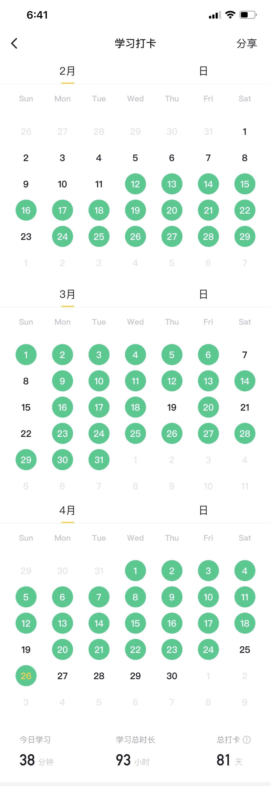

# 关于学习英语
---

自从2018年2月加入到外企工作，英语就变成为了日常工作中一项必不可少的`工具`。而对英语的学习，一直在探索一套适合自己的高效学习计划。

由于要上班，没办法花大量时间去报学习班，只能将工作之余的零碎时间利用起来，尝试过了众多的学习软件，包括`英语流利说`、`开言英语`和`百词斩`等, 但很长一段时间过后，发现并没提高太多。

经过一番反思和总结，真正需要解决的两个关键问题：
1. **词汇量** 词汇量的匮乏导致读写吃力。
2. **开口难** 认识但在说的时候想不起来。

针对这两点，开始逐个击破

> `百词斩`主要增加词汇，每天50个单词，快速过一遍，早上一次，晚上复习一次。

> `Open Language` 通过播客的形式练习听力，晚上跟读，根据上下文理解单词的实际用法

!> 通常都会遇到的一个问题，```能看懂，听不懂```,这是由于`发音`偏差导致，提高方法很简单，就是`多跟读，练发音`。
 
清晰了目标，接下来就是落实在行动上了，通过打卡记录，逼迫自己养成每日习惯。

<figure>
    
    
</figure>


