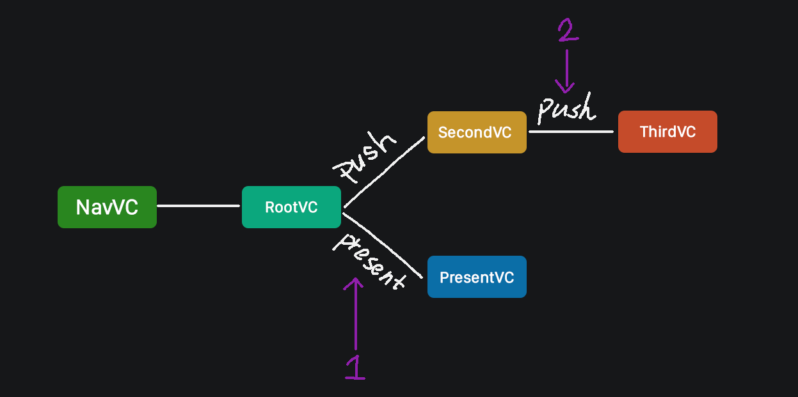
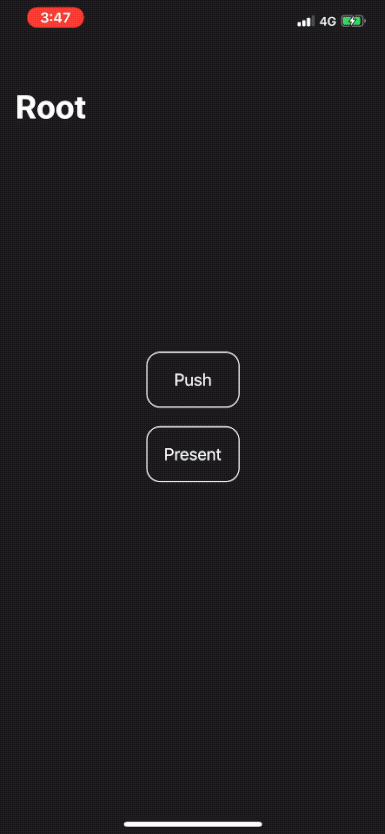
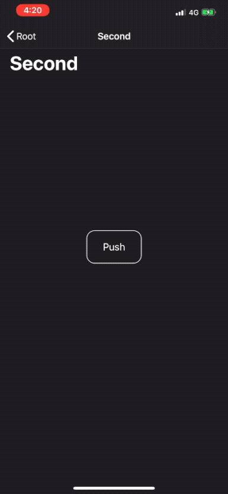
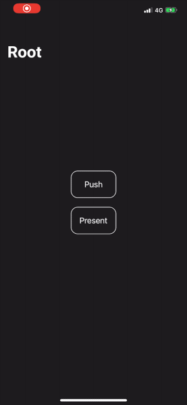

# 关于NavigationBar的显示和隐藏
---

在项目开发时，经常会用到`NavigationBar`这个组件，当一些页面需要隐藏导航栏时，如果处理不当，那么页面之间的切换就会变得不那么友好了。

## 应用结构

这里用一个很简单例子来说明下我遇到的一些问题。



* 应用采用`NavigationViewContoller`
* **RootVC** 需要隐藏导航栏
* **SecondVC** `Push`跳转，显示导航栏
* **SecondVC** `Push`跳转，显示导航栏
* **PresentVC** `Modal`视图，显示导航栏

### 隐藏和显示
```Objective-C
- (void)viewWillAppear:(BOOL)animated;

- (void)viewWillDisappear:(BOOL)animated;

- (void)setNavigationBarHidden:(BOOL)hidden animated:(BOOL)animated;
```
如果通过上面的方法在VC中设置导航栏的隐藏或显示，那么就会遇到图中标记的`1`和`2`问题。

!> 问题 1

在**PresentVC**在`Present`和`Dimiss`时，`RootVC`页面的`NavBar`会闪现



!> 问题 2

**ThirdVC**在使用`UIScreenEdgePanGesture`手势返回时，`NavBar`的显示也会有问题


### 问题分析

当**setNavigationBarHidden**的`animated`设置为True时，如果两个VC在`Window`里同时出现时，那么这两个VC在`viewWillAppear`和`viewWillDisappear`中对**NavigationBar**进行设置隐藏或显示的动作也将都会被捕捉到，从而引发这两个问题。

例如：在`ThirdVC`里侧滑手指左右拖动时，`ThirdVC`和`SecondVC`同时显示在当前窗口中，就会出现问题2的现象。
造成问题1的原因也是大致如此。

### 解决方案

知道了原因所在，那么就可以对症下药了。也就是当两个VC都出现时，采用互斥的方式，只响应一个VC的设置方法，问题自然而解了。

?> UINavigationControllerDelegate 这个就是关键所在

新建一个`BaseViewController`一个基类，并实现`UINavigationControllerDelegate`的代理方法，代码如下:
```Objective-C
/**
 Called when the navigation controller shows a new top view controller via a push, pop or setting of the view controller stack.
 */
- (void)navigationController:(UINavigationController *)navigationController willShowViewController:(UIViewController *)viewController animated:(BOOL)animated {
    if (viewController == self) {
        //hidden the navigation bar
        [navigationController setNavigationBarHidden:YES animated:YES];
    } else {
        //ignore the vcs which don't need to show the navigation bar
        if ([navigationController isKindOfClass:[UIImagePickerController class]]) {
            return;
        }
        
        [navigationController setNavigationBarHidden:NO animated:YES];
        
        //It will help automatically remove delegate when the vc viewWillDisapper.
        if (navigationController.delegate == self) {
            navigationController.delegate = nil;
        }
    }
}
```

### 使用方法
将自己的VC直接继承`BaseViewController`，然后在需要隐藏导航栏的VC里，设置以下代码:
```Objective-C
- (void)viewWillAppear:(BOOL)animated {
    [super viewWillAppear:animated];
    self.navigationController.delegate = self;
}

- (void)dealloc {
    self.navigationController.delegate = nil;
}
```
比如: 在**RootVC**中设置代理，将会隐藏导航栏，其他VC因为没有设置代理，所以当进行`Push/Pop`或`Present/Dismiss`动作时，`Window`只会对**New Top VC**进行设置显示导航栏的操作。

!> 当调用一些系统框架的VC时，不继承于BaseViewController，因此在设置导航栏需要忽略。

### 解决前后效果对比

**问题1**
<figure>
    
    
</figure>

**问题2**
<figure>
    
    
</figure>


### 问题扩展

1. 当我们隐藏导航栏后，会造成**侧滑返回**手势失效
2. 如果页面里横向滑动的`ScrollView`,那么**侧滑手势**将会和**ScrollView**的滑动冲突。

### 解决办法

新建`BaseNavigationViewController`这样一个基类，然后实现**UIGestureRecognizerDelegate**代理，代码如下：
```Objective-C
- (void)viewDidLoad {
    [super viewDidLoad];

    //识别侧滑手势并绑定代理
    if ([self respondsToSelector:@selector(interactivePopGestureRecognizer)]) {
        self.interactivePopGestureRecognizer.delegate = self;
    }
}

//当有push VC时响应侧滑手势
// called when a gesture recognizer attempts to transition out of UIGestureRecognizerStatePossible. returning NO causes it to transition to UIGestureRecognizerStateFailed
- (BOOL)gestureRecognizerShouldBegin:(UIGestureRecognizer *)gestureRecognizer {
    if (self.viewControllers.count == 1) {
        return NO;
    }
    return YES;
}

//开启多个手势的识别检测
// called when the recognition of one of gestureRecognizer or otherGestureRecognizer would be blocked by the other
// return YES to allow both to recognize simultaneously. the default implementation returns NO (by default no two gestures can be recognized simultaneously)
//
// note: returning YES is guaranteed to allow simultaneous recognition. returning NO is not guaranteed to prevent simultaneous recognition, as the other gesture's delegate may return YES
- (BOOL)gestureRecognizer:(UIGestureRecognizer *)gestureRecognizer shouldRecognizeSimultaneouslyWithGestureRecognizer:(UIGestureRecognizer *)otherGestureRecognizer {
    return YES;
}

//当侧滑和ScrollView滑动都存在时，只响应侧滑手势
// called once per attempt to recognize, so failure requirements can be determined lazily and may be set up between recognizers across view hierarchies
// return YES to set up a dynamic failure requirement between gestureRecognizer and otherGestureRecognizer
//
// note: returning YES is guaranteed to set up the failure requirement. returning NO does not guarantee that there will not be a failure requirement as the other gesture's counterpart delegate or subclass methods may return YES
- (BOOL)gestureRecognizer:(UIGestureRecognizer *)gestureRecognizer shouldBeRequiredToFailByGestureRecognizer:(UIGestureRecognizer *)otherGestureRecognizer {
    return [gestureRecognizer isKindOfClass:[UIScreenEdgePanGestureRecognizer class]];
}
```

通过实现以上代码，并继承于这个基类，这两个问题就可以得到完美解决了。