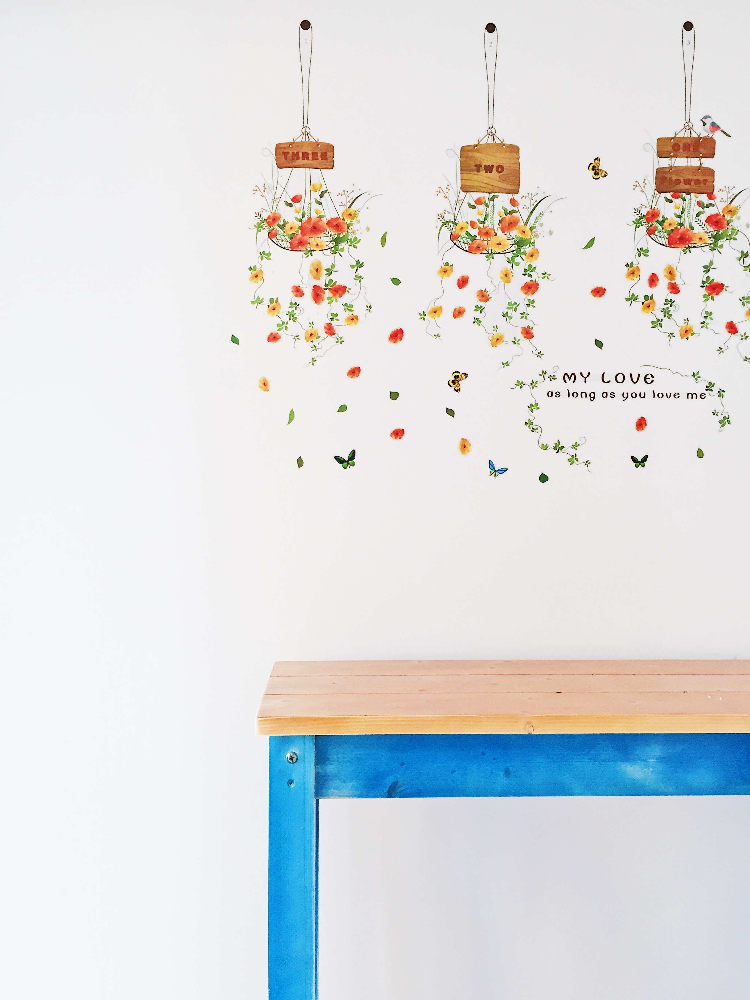
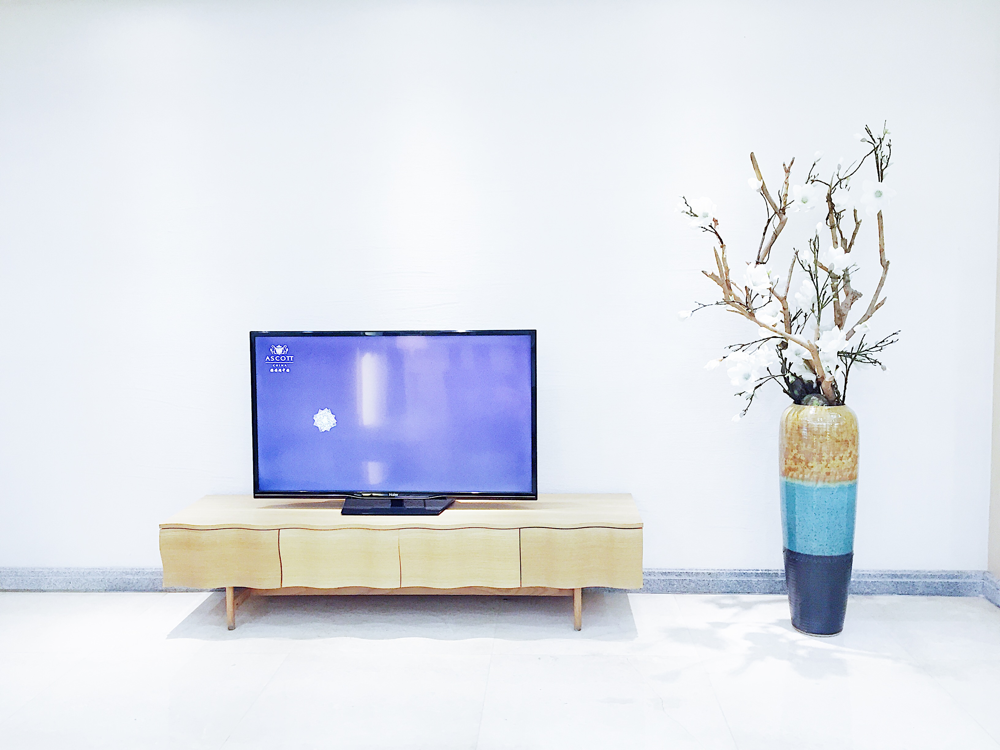
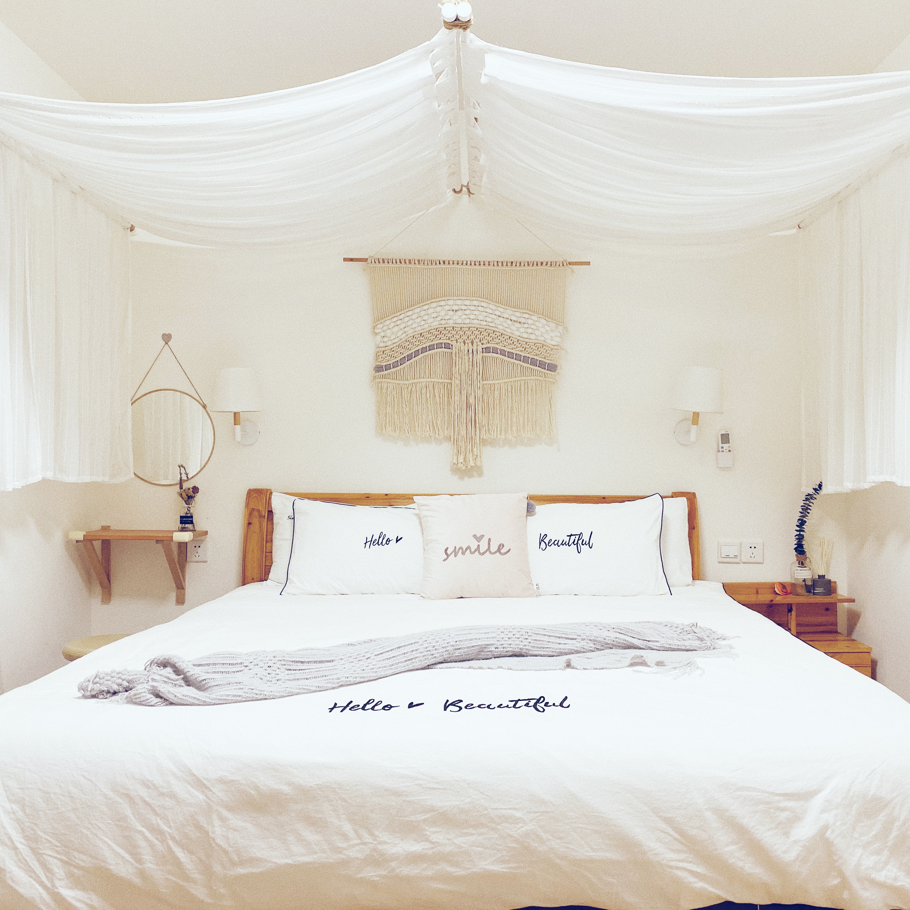
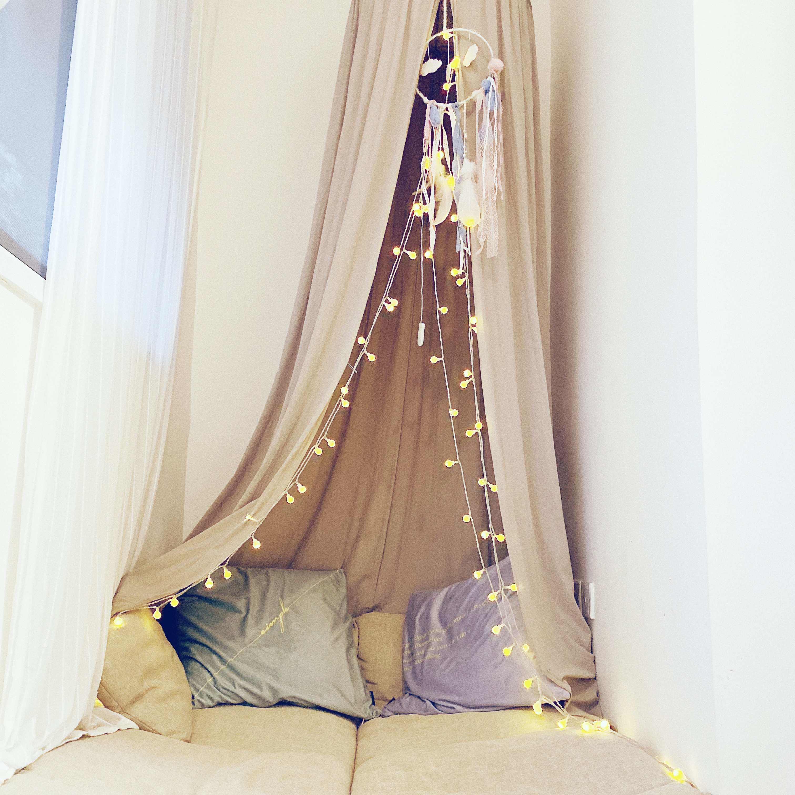

# 用镜头记录美好

和众多人一样，自己有段时间也沉迷拍照，买单反，增配件，跟着网上学习。再到后来才明白，这些事都非器材所能提升的，重要的是欣赏美的能力，所谓「器材决定下限，审美决定上限」，在审美的基础上发现美，再通过拍照的形式记录下来。

2016年曾购入了`NIKON D7100 + 18-140mm`套机，后面又买了号称「人类光学精华」的`50mm 1.8D`。本着对拍照的一腔热情，花了点时间去学习关于相机的基础知识，拍照构图以及后期图片处理的技能，算是让自己也多了一项本领。

2019年12月，将所有器材于咸鱼转手出售，如今就只用手机来记录眼前的美好事物。3年与相机的接触，除了让我学会了怎么去用相机拍照，意外地我也对视频拍摄和后期简单剪辑也有了一些接触，并为目前在职的Honeywell公司内部制作了一些小作品，其中有对产品和团队的宣传，还有为同事farewell做的纪念小视频，特别是给招聘自己进入公司的Manager做了一个质量还不错的视频，因为拍视频这件事，在公司里也备受同事关注。

总的来说，给自己找一个感兴趣的爱好，用心去培养，对自己日后肯定会有所帮助。

## 生活总要有点期待

## 很喜欢夏天的蓝

## 平静

## 整洁舒适，保持愉悦

