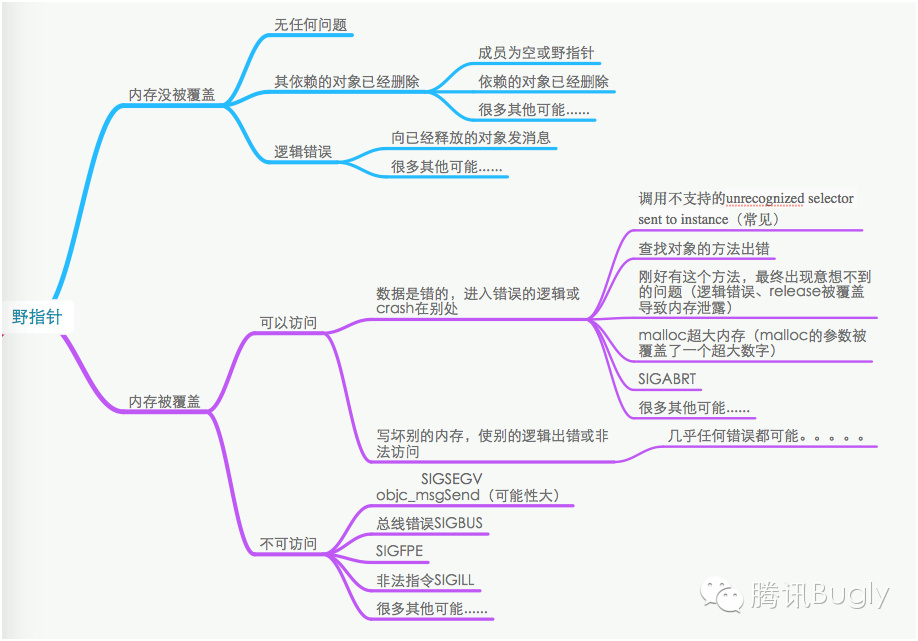

# Weak关键字的用法
---

早期`MRC`时代，当在堆上创建对象时，必须进行手动调用`release`，防止**OOM**。引入`ARC`之后便减轻了对于内存管理的烦恼。虽说系统会自动管理内存，但如果使用不当时，仍然会造成内存泄漏，比如循环引用。
而`weak`关键字的出现，就是用来帮助我们打破循环，解决内存泄漏问题。

## weak与assign的区别
二者相同的地方在于，都不会让对象引用计数器`+1`。但不同之处在于:

* assign: 用于修饰数据类型，内存分配于栈上，当出了作用域时，系统会自动回收内存。
* weak: 指向对象地址的指针，而对象是在堆上创建的，当对象释放后，系统会将指针指向nil。

如果用`assign`来修饰指向对象的地址指针，那么当对象被释放时，指针并不会被设为nil，这就会造成野指针问题。

## weak的底层探究

系统会创建一个`weak table`的哈希表

* `key` 所指向对象的地址
* `value` 指向对象地址的指针数组

当对象被释放时，系统便会根据`key`来查询到这个**指针数组**，并依次遍历数组，让指针指向nil。

## 野指针

野指针的情况有点复杂，同时处理起来也非常棘手，这里引用大神的一张图来概括下野指针:

