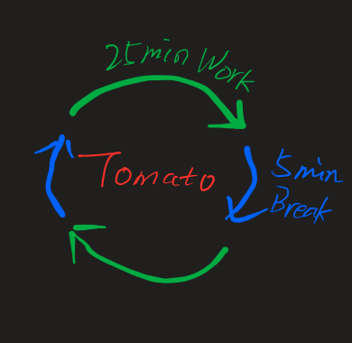
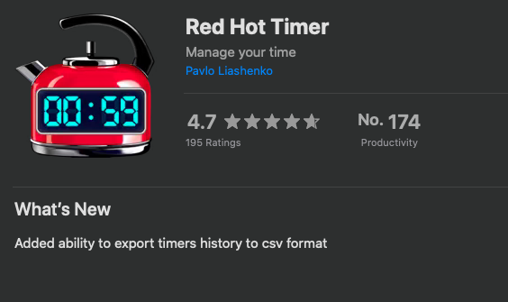
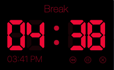
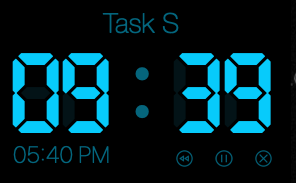
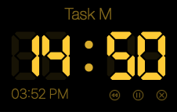
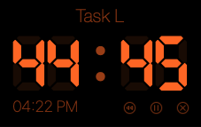

# 高效时间管理
---

白天上班一天忙的飞起，但次日`Standing Meeting`时，却回想不起来做了什么！这种情形在我身上发生了不知道多少次，我觉得这就是种`工作效率底下`的体现，搞得一身疲惫，却没有什么收获，这种感觉真的很打击人。

之前读过一篇文章，将人按照 **勤奋** 和 **懒惰** 以及 **聪明** 和 **愚笨** 四个特分为:
1. 一等人: `聪明 + 勤奋`
2. 二等人: `聪明 + 懒惰`
3. 三等人: `愚笨 + 懒惰`
4. 四等人: `愚笨 + 勤奋`

其中 **四等人** 的是最危险的人，其破坏力也是最大的人。这里的`勤奋`说直白点就是 **瞎忙活**，如果为了改变四等人这个身份，那么最简单的方式就是让自己先变得`“懒惰“`。在处理一件事情上面，有人高效率地快速完成，也有人会折腾一天才勉强搞定。就结果而言，虽然都达到了目标，但很显然高效率的人更受人欢迎。

回到高效时间管理这个话题，将做如下比喻：

**勤奋** = **长时间集中**

**懒惰** = **短时间集中**

那么`短时间集中`带来的收益会更加明显， 针对`短时间集中` 有一个非常有名叫 `番茄时间管理` 方法可以作为参考

日常工作中，可以将这个循环灵活运用，从而提升办公效率。

## 工欲善其事，必先利其器

### Mac App: Red Hot Timer

> Work & Break模式

<figure>
    
    
    
    
</figure>

这款 **Mac App** 是我目前为止觉得最为方便和好用的辅助软件，可以创建`S` `M` `L`等多种自定义模式的计时器，同时也支持窗口浮动置顶，在码代码时可以轻松统计时间。