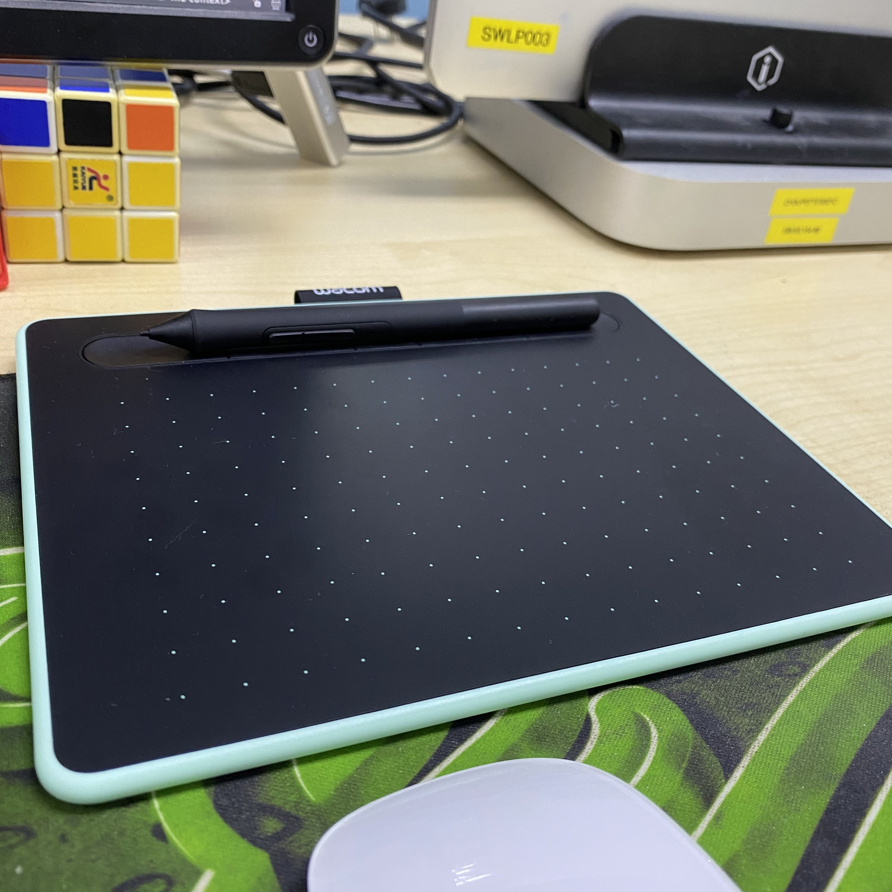
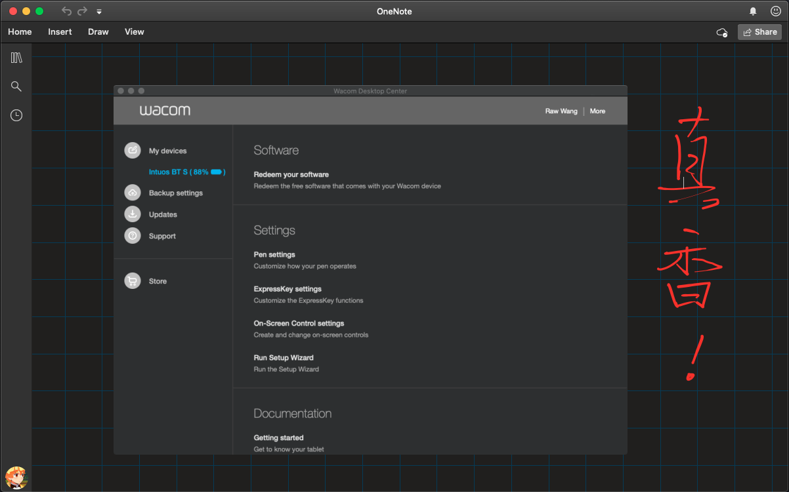
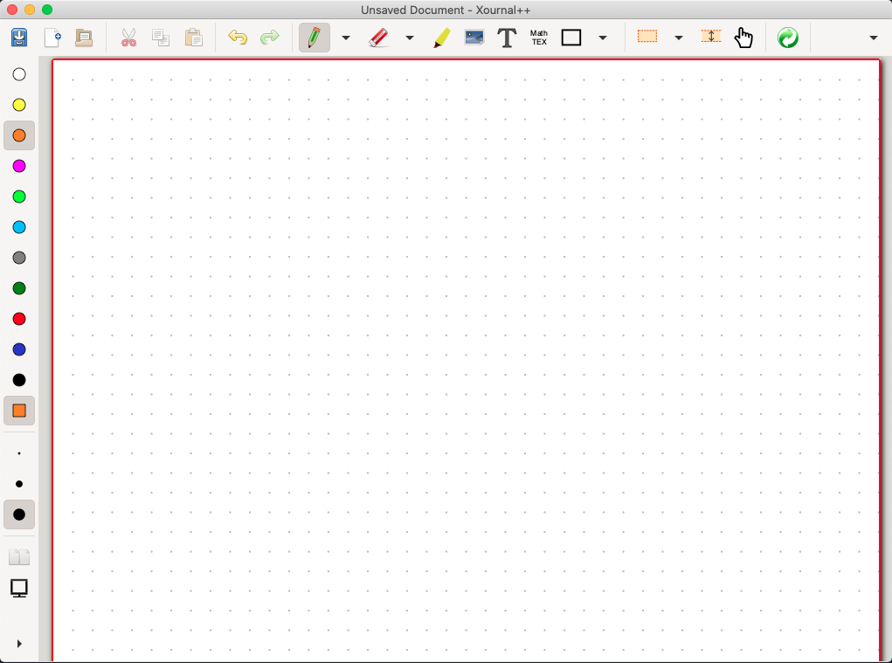
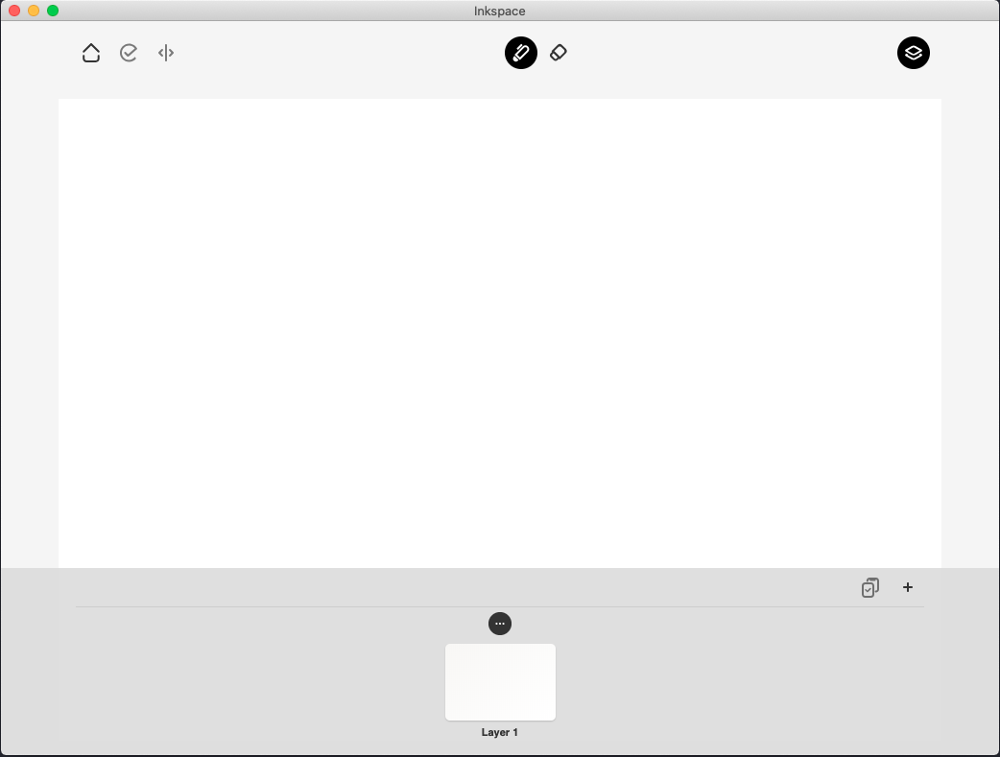

# Wacom之初体验
---

## 种草
之前在创维工作时，很喜欢与设计组的小伙伴玩耍，也结交了几位不错的设计师朋友。那时看到他们桌上放着一个黑乎乎的板子，并不知道是干嘛用的。后来才知道这玩意学名叫数位板，用来画画的工具。

一开始并没有购买的想法，直到在B站看一位UP主喜欢用图解的形式来讲解一些复杂的算法，整个过程比看纯文字的题解轻松多了，非常形象生动。所以心里萌生了自己在做题时是不是也可以通过画图的方法来理解一些算法思想。

于是乎就开始在网上搜寻关于数位板好用的品牌以及性价比较高的型号，经过一番折腾，最后选择了`Wacom`这个牌子，原本只打算`200¥`以内买一个入门版就行了，但因为`COVID-19`疫情，国内全面实行网络在线教学，数位板也变得额外畅销，很多型号都已缺货。最后无奈之下斥巨资买了一个贵的。

## 产品型号
**型号:** `Wacome CTL-4100 WL 蓝牙无线版`

**价格:** `699¥`

**尺寸:** `S`

**体验:** 
> 在品牌的加持下，这款产品做工和设计都深得我心，不过因为买的最`S`号，所以一开始很不习惯，花了不少时间去研究设置，其中包括笔的压感，灵活度，触控区域等等。这里需要说下，一开始在使用`无线模式`时，那个延迟让我一度想退货，真的无法容忍和习惯。后来无意间「长按作为右键点击」关掉时，意外出现了，延迟它居然消失了。网上查了下，才知道原来这个模式下，板子会持续检查当前笔的触控状态，才导致的延迟。好吧，狗命算是保住了，留下继续使用。

**开箱视频**
<iframe 
    width="800" 
    height="450" 
    src="/images/wacom.mov"
    frameborder="0" 
    allowfullscreen>
</iframe>

**板子外观**

## 软件软件
在选用什么软件做笔记也是折腾了几天，最后决定使用`MS`的`OneNote`。

1. **Xournal：**这是买数位板的初衷，和大佬学习时种草的，软件本身历史悠久，功能设计很全！
2. **Inkspace：**Wacom官方的一个专用素描绘画类的应用，非常喜欢它的设计风格，只是满足不了我的需求。
3. **Onenote：**目前在使用，MS家的一款功能十足应用。

!> Inkspace 让我有个开发Mac App的想法，基于它本身，再加入些满足我个人需求的功能，感觉将会变得很Cool！

### OneNote

    

### Xournal

    

### Inkspace

    

## 最后
希望能把它变成生产工具，而不是一时的冲动消费！

